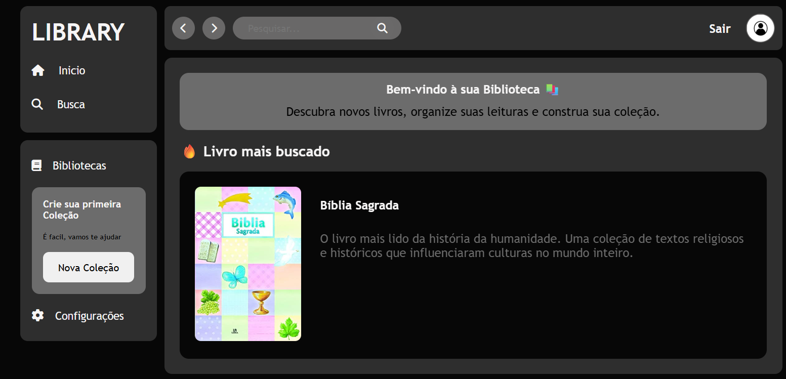

# 📚 Library: Sistema de Gerenciamento de Coleções

**Deploy** [Aqui](https://deleon-santos.github.io/Library/)

Uma aplicação Full Stack que combina a agilidade de buscas em APIs públicas com a persistência de dados em um ecossistema Flask.

  **Backend**
  Construido em Flask esta hospedado no Render(a versão free constuma hibernar e leva alguns segundo para retornar a disponibilidade)
  
  **Frontend**
  Esta hospedado no github pages.

  **Database**
  Hopedado no Supabase na versão gratuita

---

## 🛠️ Tecnologias e Ferramentas

| Categoria | Tecnologia | Ícone |
| :--- | :--- | :--- |
| **Linguagem Backend** | Python 3.12+ |  |
| **Framework Web** | Flask |  |
| **Banco de Dados** | PostgreSQL |  |
| **Frontend** | HTML5 / CSS3 / JS |  |
| **Deploy** | Render |  |

---

## 🌐 Arquitetura de Dados e APIs

O projeto opera com um modelo triplo de integração de dados para garantir performance e escalabilidade:

### 1. 📖 OpenLibrary API (Pública)
Utilizada para o motor de busca global. Permite que o usuário encontre milhões de livros em tempo real consumindo metadados diretamente da [OpenLibrary](https://openlibrary.org/).

### 2. 📄 Camada JSON (Local)
Uma API local baseada em arquivos JSON estáticos para carregar dados de configuração, categorias pré-definidas e elementos de interface que não necessitam de processamento no banco de dados.

### 3. 🐍 Flask Collections API (Persistente)
Desenvolvida em **Flask**, esta API é responsável pelo CRUD (Criação, Leitura, Atualização e Deleção) das coleções dos usuários.
* **Conexão:** Integrada ao **PostgreSQL** através do driver `psycopg2-binary`.
* **Gerenciamento:** Armazena as preferências, bibliotecas salvas e status de leitura de cada usuário de forma segura.

---

## 🏗️ Estrutura do Projeto

* **Frontend:** Interface responsiva com manipulação dinâmica de DOM.
* **Destaque:** Menu `aside-bar` inteligente que fecha automaticamente após a seleção.
* **Backend:** Estrutura modular utilizando *Application Factory* (`create_app`).
* **Segurança:** Gerenciamento de chaves e strings de conexão via `python-dotenv`.

---

